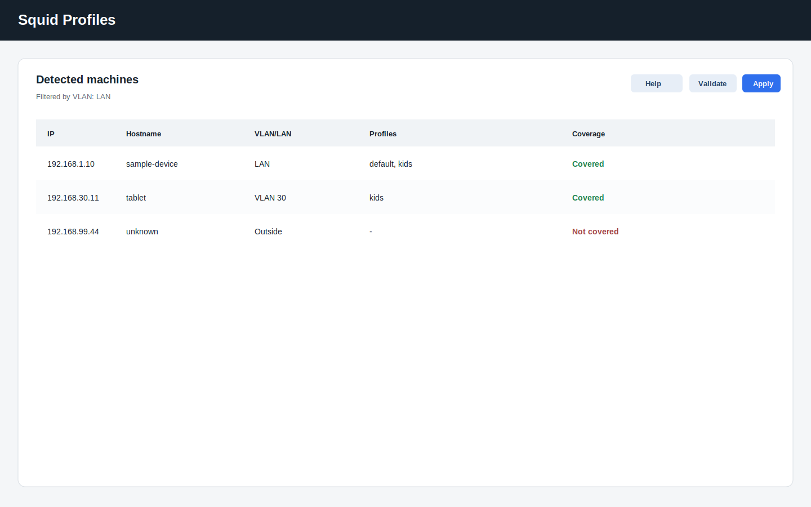
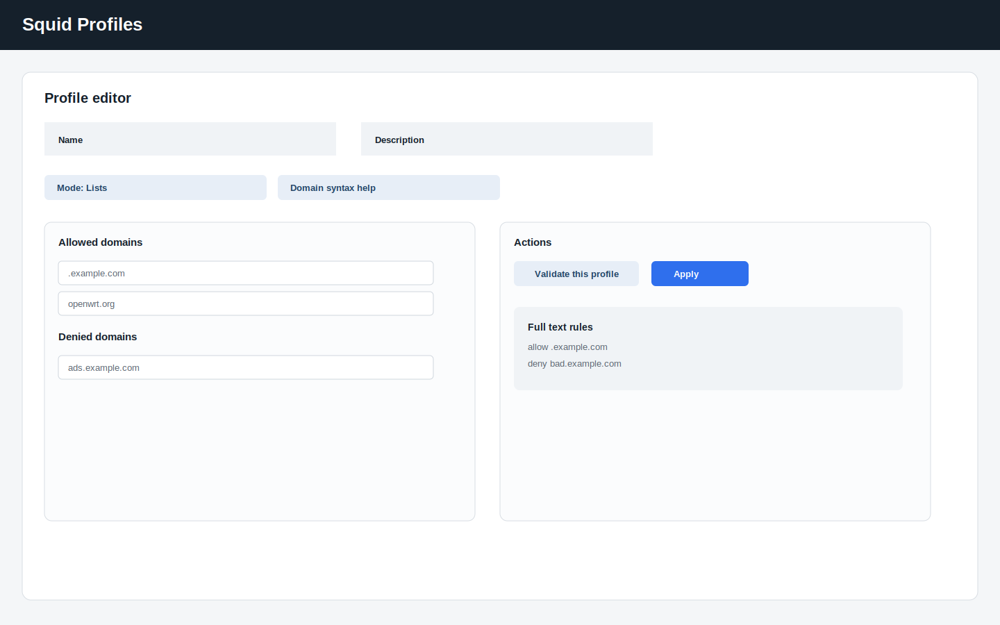
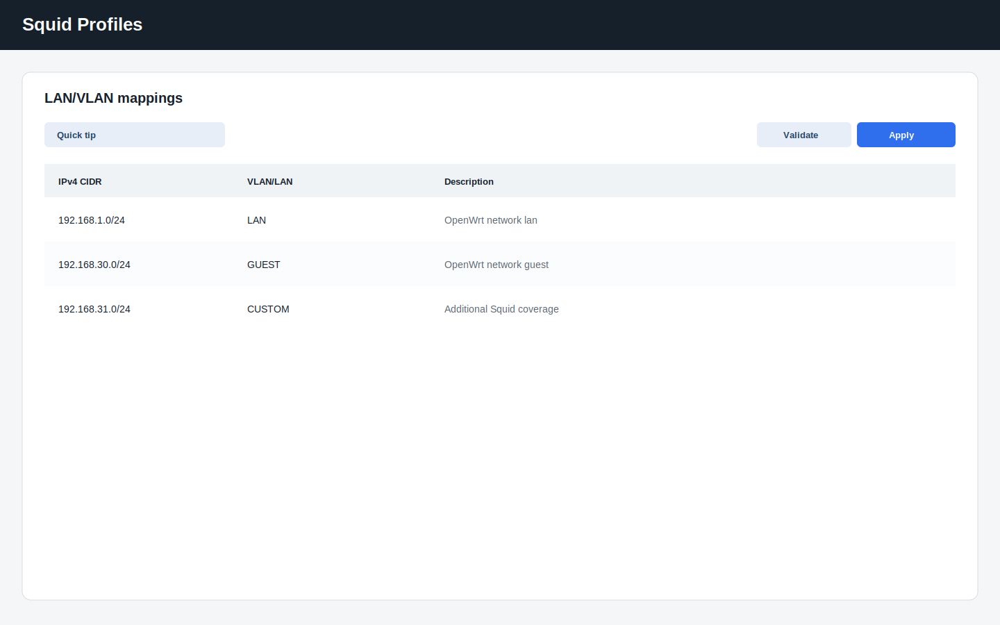

# Squid Profiles User Guide

`luci-app-squid-profiles` is a LuCI package for managing Squid access profiles on OpenWrt without editing `/etc/squid/squid.conf` by hand.

The interface is designed for low-power routers: it keeps the configuration UCI-backed, avoids heavy frontend dependencies, and validates Squid before every apply.

## Installation

### OpenWrt package install

Install the generated IPK on the router:

```sh
opkg install ./luci-app-squid-profiles_*.ipk
```

The package depends on LuCI, rpcd, UCI and Squid. Build it from the OpenWrt SDK with:

```sh
make package/luci-app-squid-profiles/compile V=s
```

### First start

On first run, the plugin ensures this layout exists:

```text
/etc/squid/
├── squid.conf
├── domains/
└── maps/
```

If an existing `squid.conf` is present and not managed by the plugin, it is backed up with a dated filename before any new skeleton is created.

## What It Does

- Lists detected machines from OpenWrt host hints and saved UCI assignments.
- Lets you assign one or more Squid profiles to an IP address.
- Lets you define covered networks with IPv4 CIDR and VLAN or LAN labels.
- Lets you create Squid profiles with either list-based editing or a full-text rules mode.
- Validates the generated Squid configuration with `squid -k parse` before applying changes.

## Domain Syntax

Squid wildcard matching uses a leading dot:

```text
.example.com
```

Do not use:

```text
*.example.com
```

In list mode, enter exact domains or leading-dot wildcard domains. In full-text mode, use one rule per line:

```text
allow .example.com
deny ads.example.com
```

## Use Cases

### 1. Home network with a guest VLAN

Create a network entry for the guest subnet, then assign a restrictive profile to guest devices only.

### 2. Family-safe browsing policy

Use a profile with allowed and denied domains to keep access focused on approved services.

### 3. Device-specific proxy policy

Assign multiple profiles to a single IP when a device needs a combined policy, for example a baseline profile plus a temporary exception profile.

### 4. Per-VLAN policy review

Filter the main machine list by VLAN or LAN label to review which devices are covered and which profiles are attached.

## Screenshots

The following reference screenshots are included with the repository.

### Main machine list



### Profile editor



### Covered networks



## Suggested Workflow

1. Open **Services -> Squid Profiles** in LuCI.
2. Define covered networks first.
3. Create one or more profiles.
4. Assign profiles to detected machines.
5. Click **Validate configuration**.
6. Review the Squid output.
7. Click **Apply** only after validation succeeds.

## Validation And Apply

Every apply path validates the generated configuration first:

```sh
squid -k parse
```

If validation fails, Squid is not reloaded and the error output is returned in LuCI.

## Debug Commands

```sh
logread
squid -k parse
squid -k reconfigure
/usr/libexec/squid-profiles init
/usr/libexec/squid-profiles validate
/usr/libexec/squid-profiles apply
```

## Notes

- The list and full-text profile modes are exclusive. Use one source of truth at a time.
- Only IPs covered by the configured networks can receive profile assignments.
- The plugin keeps dated backups before rewriting the main Squid configuration.

